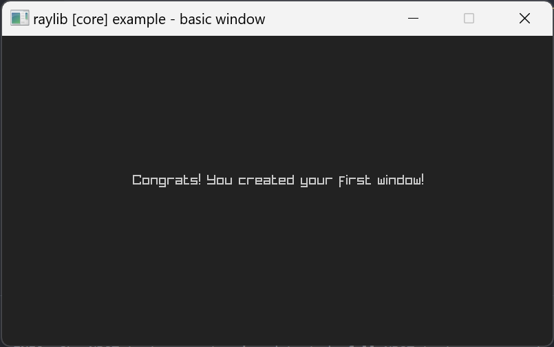

# pkpy-bindings

**Automatically Generate PkPy<=>C Bindings (cpp+pyi)**

This repo contains a python package `pkpy_bindings` that can be used to generate bindings for C libraries.
It uses [raylib's JSON format](https://github.com/raysan5/raylib/blob/master/parser/output/raylib_api.json) for describing the API.

You can use [raylib's parser](https://github.com/raysan5/raylib/tree/master/parser) to generate one for your own project.

## Requirements

+ Python 3.8 or higher

## Generate raylib's bindings

```
python build.py
```

This generates two files:

+ https://github.com/blueloveTH/pkpy-bindings/blob/main/output/raylibw.cpp
+ https://github.com/blueloveTH/pkpy-bindings/blob/main/output/typings/raylib.pyi

## What `build.py` looks like

```python
from pkpy_bindings import generate

pyi_path = 'output/typings/raylib.pyi'
cpp_path = 'output/raylibw.cpp'

generate(
    'raylib/parser/output/raylib_api.json',
    module_name='raylib',
    headers=['raylib.h'],
    ignored_functions=IGNORED_FUNCTIONS,
    vector_pattern=r'\bVector(\d)\b',
    opaque_structs=['rAudioBuffer', 'rAudioProcessor']
).save(pyi_path, cpp_path)
```

## Build the example

```
cd output
mkdir build
cd build

cmake ..
cmake --build .
cd Debug
raylibw_test.exe
```



## References

+ [pocketpy](https://github.com/blueloveth)
+ [raylib](https://github.com/raysan5/raylib)